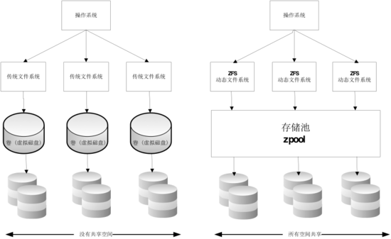
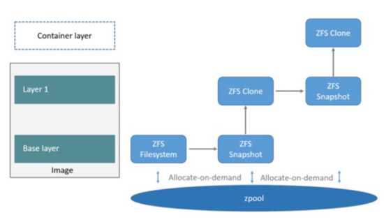

# docker存储

docker对镜像和容器，采用层叠加和写时复制（CoW）技术。在不同的存储驱动下其实现方式不同，也具有不同的特性。没有单一的驱动适合所有的应用场景，要根据不同的场景选择合适的存储驱动，才能有效的提高Docker的性能。如何选择适合的存储驱动，要先了解存储驱动原理才能更好的判断。本文就此展开谈论。

## AUFS

AUFS是docker最早采用，也是目前最成熟的存储驱动。AUFS能透明覆盖一或多个现有文件系统的层状文件系统，把多层合并成文件系统的单层表示。简单来说就是支持将不同目录挂载到同一个虚拟文件系统下的文件系统。这种文件系统可以一层一层地叠加修改文件。无论底下有多少层都是只读的，只有最上层的文件系统是可写的。当需要修改一个文件时，AUFS创建该文件的一个副本，使用CoW将文件从只读层复制到可写层进行修改，结果也保存在可写层。在Docker中，底下的只读层就是image，可写层就是container。结构如下图所示：

不同容器可以共享相同的镜像层。有以下几个

- 容器启动快。因为不同容器可以共享相同的镜像层，所以容器启动过程中不必再重新启动已存在的镜像。
- 节省存储空间
- 节省内存

**读写**

逐层搜索文件，直到找到文件，有一定的操作时延。对文件进行修改时，需要将文件复制到最上的读写层，不过以后的对此文件的读写都直接在最上层上进行。另外应为操作对象时文件，即使是对大文件进行某小部分的修改，都需要将文件全部复制到最上面的读写层。而且多个容器都对文件修改时，都会在各自的读写层上复制一个独立的副本。在文件大，容器多的场景，会有不少存储空间损耗。

**删除**

直接在容器层标记文件删除，速度快。

**相容性**

不完全支持`rename(2)`。会有 `EXDEV` (“cross-device link not permitted”)错误，即使源路径和目标路径在同一AUFS层。

**使用场景**

适合于容器密集环境，比如PaaS环境。

## Overlay

Overlay类似于AUFS，相比有以下不同： 

- 设计更简单
- 自3.18已合入Linux内核主线 
- 更快

和AUFS的多层不同的是overlay只有两层：一个 upper 文件系统和一个 lower 文件系统，分别代表Docker的镜像层和容器层。当需要修改一个文件时，使用CoW将文件从只读的lower 复制到可写的upper进行修改，结果也保存在 lower 层。在Docker中，底下的只读层就是image，可写层就是container。结构如下图所示：

`overlay`只有两层，也就意味着并不能实现多层镜像。. Instead, each image layer is implemented as its own directory under `/var/lib/docker/overlay`. Hard links are then used as a space-efficient way to reference data shared with lower layers. 

**overlay2**

从Docker1.12开始支持`overlay2`。overlay2在Linux4.0后提供，性能比overlay更好，消耗更少的inode.

**性能**

因为层级少，消耗更少的搜索时间，所以比AUFS有更少的读写时延。

OverlayuFS支持页缓存共享。多容器访问同一文件能够共享页缓存，使得`overlay`/`overlay2`内存上更加高效。

 OverlayFS supports page cache sharing. This means multiple containers accessing the same file can share a single page cache entry (or entries). This makes the `overlay`/`overlay2` drivers efficient with memory and a good option for PaaS and other high density use cases.

`overlay`极快消耗inode，特别在镜像多、容器多的机器上，很容易造成inode耗尽。`overlay2`没有这问题。

**相容性**

- **open(2)**. OverlayFS only implements a subset of the POSIX standards. This can result in certain OverlayFS operations breaking POSIX standards. One such operation is the *copy-up* operation. Suppose that your application calls `fd1=open("foo", O_RDONLY)` and then `fd2=open("foo", O_RDWR)`. In this case, your application expects `fd1` and `fd2` to refer to the same file. However, due to a copy-up operation that occurs after the first calling to `open(2)`, the descriptors refer to different files.

- **rename(2)**. 调用`reanme(2)`目录，只允许源路径和目标路径在都在上层，否则返回 `EXDEV` (“cross-device link not permitted”)错误。

每个镜像层在宿主机上表现为一个目录`/var/lib/docker/overlay/<ID>`。目录下包含完整的文件系统。不同的镜像层共享同一个文件，通过硬链接方式实现。`overlay` driver only works with a single lower OverlayFS layer and hence requires hard links for implementation of multi-layered images

## Devicemapper

`devicemapper`驱动存储每个镜像和容器在各自的虚拟设备中，这些设备是按需分配的。Device Mapper技术操作以块为单位，而不是文件，这就意味着修改文件时只要复制其中的块，而不需要复制整个文件。

为了开箱即用，docker的devicemapper默认采用`loop-lvm`模式，而这种模式只能用在测试环境。在生产环境中需要使用成`deirect-lvm`

**性能**

写新文件时采用写时分配策略。以64k为单位分配空间并完成挂在到读写层上。若每次写到的数据很小，远远少于64k，会造成存储空间的浪费。

修改镜像中的文件以写时复制策略。以64k为单位复制数据块到读写层。对大文件只需要复制其中的数据块，十分高效。然而对大量的小数据修改，性能不比AUFS。

总结：适合大文件，不适合小文件

## ZFS

ZFS 文件系统是一个革命性的全新的文件系统，它从根本上改变了文件系统的管理方式，ZFS 完全抛弃了“卷管理”，不再创建虚拟的卷，而是把所有设备集中到一个存储池中来进行管理，用“存储池”的概念来管理物理存储空间。过去，文件系统都是构建在物理设备之上的。为了管理这些物理设备，并为数据提供冗余，“卷管理”的概念提供了一个单设备的映像。而ZFS创建在虚拟的，被称为“zpools”的存储池之上。每个存储池由若干虚拟设备（virtual devices，vdevs）组成。这些虚拟设备可以是原始磁盘，也可能是一个RAID1镜像设备，或是非标准RAID等级的多磁盘组。于是zpool上的文件系统可以使用这些虚拟设备的总存储容量。

下面看一下在docker里ZFS的使用。首先从zpool里分配一个ZFS文件系统给镜像的基础层，而其他镜像层则是这个ZFS文件系统快照的克隆，快照是只读的，而克隆是可写的，当容器启动时则在镜像的最顶层生成一个可写层。如下图所示：

当要写一个新文件时，使用按需分配，一个新的数据快从zpool里生成，新的数据写入这个块，而这个新空间存于容器（ZFS的克隆）里。

当要修改一个已存在的文件时，使用写时复制，分配一个新空间并把原始数据复制到新空间完成修改。

**性能**

ZFS驱动的性能受以下几个方面影响：

- 内存。内存对ZFS的性能影响很大。ZFS最初就是为有大内存的Sun Solaris servers设计的。

- ZFS特性。在利用ZFS特性，比如冗余特性，会很明显地增加内存消耗。基于内存消耗和性能考虑，推荐关掉ZFS冗余特性。然而在SAN或者NAS阵列栈的其他层来说，冗余并不会影响内存的使用和性能，仍然可以开启冗余特性。

- ZFS缓存。ZFS将磁盘块缓存在内存中的技术是自适应替换缓存(adaptive replacement cache, ARC)。ZFS的*单拷贝ARC*特性允许一个块的单拷贝能够被多个文件系统所共享，这就意味着运行着的多个容器能够共享一个缓存块，很适合在PaaS以及其他高密度容器的平台使用

- 碎片。碎片化是ZFS写时复制的副作用。以128K的大小进行写，可以通过减少碎片的产生。还可以通过比如ZFS intent log (ZIL) 以及级联写 (延时写)

- 在Linux上使用原生ZFS。尽管Docker ZFS存储驱动实现了ZFS FUSE，但在对性能要求高情况下，原生的ZFS会有更好的表现。

## Btrfs

Btrfs被称为下一代写时复制文件系统，并入Linux内核，也是文件级级存储，但可以像Device mapper一直接操作底层设备。Btrfs把文件系统的一部分配置为一个完整的子文件系统，称之为 subvolume 。那么采用 subvolume，一个大的文件系统可以被划分为多个子文件系统，这些子文件系统共享底层的设备空间，在需要磁盘空间时便从底层设备中分配，类似应用程序调用 malloc() 分配内存一样。为了灵活利用设备空间，Btrfs 将磁盘空间划分为多个chunk 。每个chunk 可以使用不同的磁盘空间分配策略。比如某些 chunk 只存放 metadata，某些 chunk 只存放数据。这种模型有很多优点，比如Btrfs 支持动态添加设备。用户在系统中增加新的磁盘之后，可以使用 btrfs 的命令将该设备添加到文件系统中。Btrfs把一个大的文件系统当成一个资源池，配置成多个完整的子文件系统，还可以往资源池里加新的子文件系统，而基础镜像则是子文件系统的快照，每个子镜像和容器都有自己的快照，这些快照则都是subvolume的快照。

当写入一个新文件时，为在容器的快照里为其分配一个新的数据块，文件写在这个空间里，这个叫用时分配。而当要修改已有文件时，使用CoW复制分配一个新的原始数据和快照，在这个新分配的空间变更数据，变结束再更新相关的数据结构指向新子文件系统和快照，原来的原始数据和快照没有指针指向，被覆盖。

**性能**

btrfs存储驱动的性能收到以下方面的影响：

- 页缓存。btrfs不支持页缓存，这意味着多个容器访问同一文件需要缓冲多分实例，因此，不适合PaaS以及其他高密度容器平台。
- 小写。频繁的小写（包括宿主机启动和停止许多容器）会使得Btrfs块使用率很低，最终导致宿主机磁盘空间不足而停止工作。这也是目前版本Brtfs的最大问题。在使用Btrfs时候，需要使用` btrfs filesys`命令来检查磁盘剩余空间，而不要相信Unix命令`df`。
- 连续写。
- 碎片化。写时复制会导致存储的碎片化。大量的随机写会加重这问题。在最近的Btrfs版本中允许使用`autodefrag` 作为挂载选项。这种模式会检测随机写并且进行除碎片化。在使用之前，需要再docker宿主机上进行性能测试，有时候会导致更差的性能。
- 协调BTRFS。使用cronjob来再协调你的BTRFS设备，比如在raid设备上扩展子卷，重声明未使用的块。

## Data volume

docker的数据卷并不受存储驱动的影响，读写数据卷的性能是native host speeds.

## 选择合适的驱动

总结以上的存储驱动特性，归纳如下表：

总之：

1. 没有单独一个驱动能够使用与每个场景
2. 存储驱动时刻都在进步，需要不停跟踪
3. 别忘了数据卷的性能是本地速度

