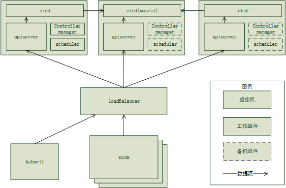

# kubernetes master的高可用设计

Kubernetes作为容器编排管理系统，通过Scheduler、Replication Controller等组件实现了应用层的高可用，但是针对Kubernetes集群，还需要实现Master组件的高可用。本文介绍社区推荐的Kubernetes Master High Availability设计。

kubernetes master包含组件有：apiserver, scheduler, controller-manager, etcd。总系统图见下：

## etcd

在系统中，每个apiserver对应一个etcd，部署在用一台机子上，并且只与他对应的etcd通过localhost进行直接交互。多个etcd实例组建成一个集群，其中一个实例被选举为mater，负责数据的读写。对其他节点的读写操作都会被转发到master上进行。这转发会导致一定的延时，但是不会太大。

etcd的命令行参数中需哟设置以下两个值：

> -initial-cluster: etcd集群列表，如“infra0=http://10.0.1.10:2380,infra1=http://10.0.1.11:2380,infra2=http://10.0.1.12:2380”
> -initial-cluster-state: 设置诶new

## apiserver

所有的apiserver都是并行地独立工作，并只与本地的etcd进行数据存取。外部对apiserver的访问，比如etcdctl，node等，都经过负载均衡器转发到随机一个master，实现压力的分摊。loadbalancer可以选用nginx或者haproxy做软件均衡。

### controller manager & scheduler

由于controller manager和scheduler设计为有状态的组件，他们不能像apiserver一样多实例同时工作。在多份实例中通过抢占租赁锁来实现工作实例的选举，其他实例处于热备状态。

## 参考文献

[Automated HA master deployment]: https://github.com/kubernetes/community/blob/master/contributors/design-proposals/ha_master.md